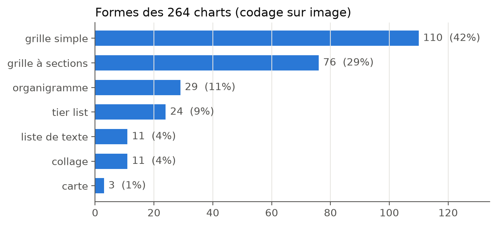
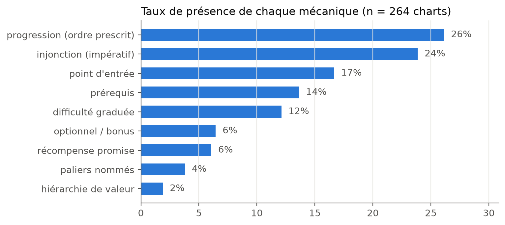
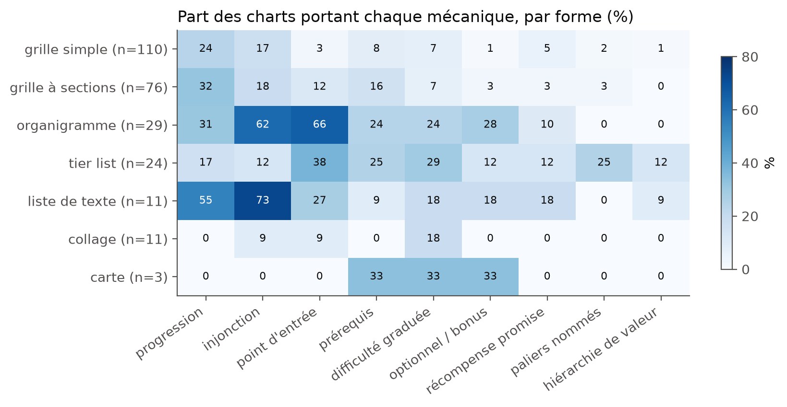
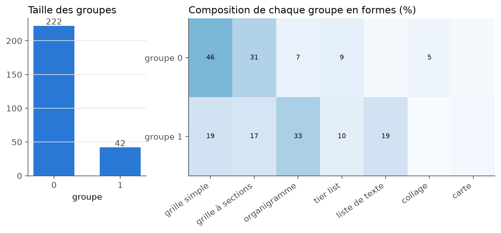
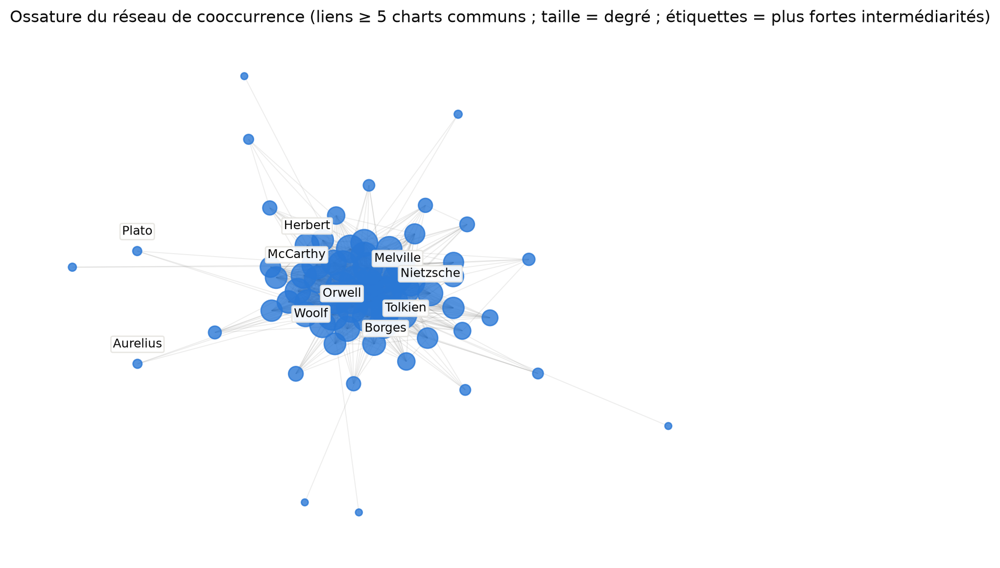

# « That's kino anon » : les charts de /lit/ comme dispositifs gamifiés. D'une lecture qualitative à une mesure computationnelle du corpus

**Marc Garnier**

Version étendue du travail présenté au séminaire COM 885. Juillet 2026.

Code, données dérivées et carnet d'analyse : <https://github.com/marcgarnier/lit-charts>

---

## Résumé

Ce travail étudie les *charts* de lecture du board /lit/ de 4chan — des images qui recommandent des corpus d'auteurs — en tant que dispositifs gamifiés de diffusion de radicalités littéraires. Une première enquête qualitative, conduite sur un échantillon d'une dizaine de charts issus d'une base de 262, avait dégagé quatre mécaniques de gamification (progression, récompense symbolique, simplification cognitive, identification communautaire) et trois structures de cadrage (guides initiatiques, canons culturels, cartographies ludiques). La présente version soumet ces catégories à l'épreuve d'une mesure exhaustive : un pipeline computationnel local et reproductible — OCR, reconstruction géométrique de la mise en page, relevé lexical de neuf registres de gamification, codage de la forme des 264 images, classification non supervisée, réseau de cooccurrence des auteurs — traite l'intégralité du corpus. Les résultats précisent la thèse initiale plus qu'ils ne la confirment. Les trois quarts des charts (74,6 %) sont des catalogues qui juxtaposent sans prescrire de parcours ; la gamification s'avère d'abord discursive (26,1 % des charts prescrivent un ordre, 23,9 % recourent à l'impératif) quand son décorum vidéoludique est rare (paliers nommés : 3,8 % ; hiérarchie de valeur : 1,9 %) ; le travail prescriptif se distribue entre l'agencement visuel et l'énonciation, qui se compensent. La classification émergente ne retient que deux familles — catalogues muets et guides prescriptifs — et ne recoupe ni la forme visuelle ni le thème (indices de Rand ajustés de 0,09 et 0,02) : la troisième structure théorisée ne se sépare pas empiriquement. Enfin, le canon mis en circulation fonctionne comme un bloc solidaire (densité de cooccurrence de 56,5 % sur le noyau de 124 auteurs) sans qu'aucun nom ne soit obligatoire. La radicalité diffuse moins par l'initiation balisée que par la reconduction d'une liste : la conformité précède l'initiation. L'article documente également deux résultats négatifs de méthode, dont le rejet mesuré (α de Krippendorff = 0,078) de la classification automatique des formes par modèle vision-langage local.

**Mots-clés :** 4chan, gamification, contre-sphère publique, cadrage, canon littéraire, méthodes computationnelles, analyse de contenu

## Abstract

This paper studies the reading *charts* of 4chan's /lit/ board — images recommending corpora of authors — as gamified devices for the diffusion of literary radicalism. An initial qualitative inquiry over a sample drawn from a base of 262 charts identified four gamified mechanics and three framing structures. The present version puts these categories to the test of exhaustive measurement: a local, reproducible computational pipeline — OCR, geometric layout reconstruction, lexical screening of nine gamification registers, form coding of all 264 images, unsupervised clustering, and an author co-occurrence network — processes the whole corpus. Results refine rather than confirm the initial thesis. Three quarters of the charts (74.6%) are catalogues that juxtapose without prescribing a route; gamification proves discursive first (26.1% of charts prescribe an order, 23.9% address the reader in the imperative) while its video-game decorum is rare (named tiers: 3.8%; value hierarchy: 1.9%); prescriptive work is distributed between layout and utterance, which compensate for each other. Emergent clustering retains only two families — mute catalogues and prescriptive guides — and matches neither visual form nor topic (adjusted Rand indices of 0.09 and 0.02): the third theorised structure does not separate empirically. Finally, the circulated canon behaves as a solidary block (56.5% co-occurrence density over the 124-author core) with no single obligatory name: radicalism spreads less through waymarked initiation than through the reproduction of a list — conformity precedes initiation. The paper also documents two negative methodological results, including the measured rejection (Krippendorff's α = 0.078) of automatic form classification by a local vision-language model.

**Keywords:** 4chan, gamification, counter-public sphere, framing, literary canon, computational methods, content analysis

---

## 1. Introduction

La montée des forums de discussion en ligne comme 4chan a profondément transformé l'espace public et la communication politique. Le board Literature de ce forum (/lit/), dédié en principe à la littérature et aux humanités, illustre cette mutation : il devient un lieu où la culture sert de support à la diffusion d'idéologies et de visions du monde, parfois radicales. À travers des visuels appelés *charts* de lecture, les usagers y recommandent des corpus d'auteurs organisés selon des logiques de progression et de hiérarchie que l'on peut qualifier de « gamifiées ».

La communication politique contemporaine s'inscrit dans un contexte de sphères publiques fragmentées (Bennett & Pfetsch, 2018) : les interactions ne se construisent plus autour d'un espace commun mais dans une multiplicité d'arènes discursives, souvent en ligne. Cette configuration déstabilise le modèle habermassien d'un espace public reposant sur l'échange rationnel entre citoyens égaux (Habermas, 1978). Sur 4chan, les interactions sont anonymes, affectives et hautement symboliques ; de ce chaos naissent de nouvelles formes de légitimité et de circulation de l'information. À la suite de Fraser (2001), on peut faire l'hypothèse que /lit/ fonctionne comme une contre-sphère publique numérique, où culture littéraire et culture internet se mêlent pour devenir des vecteurs de diffusion de radicalités politiques — un espace où, comme le note De Zeeuw (2024) à propos des pseudo-sphères publiques, rien n'est tout à fait sérieux ni tout à fait jeu.

Le travail initial (Garnier, 2026) analysait qualitativement une dizaine de charts sélectionnés dans une base de 262. Il concluait à l'existence de quatre mécaniques gamifiées récurrentes et de trois structures de cadrage, et soutenait que la diffusion de radicalités tient moins à un militantisme avéré qu'à une économie des symboles valorisant l'appartenance subculturelle. Ces résultats reposaient toutefois sur un échantillon restreint, lu à la main. La présente version pose la question qui en découle : **que reste-t-il de ces catégories quand on mesure l'intégralité du corpus ?**

Pour y répondre, nous avons construit un pipeline computationnel entièrement local et reproductible qui traite les 264 images du corpus : extraction du texte, reconstruction de la structure visuelle, relevé systématique du vocabulaire de la gamification, codage de la forme de chaque chart, classification non supervisée et analyse de réseau des auteurs cités. La démarche assume un double objectif : produire des résultats empiriques sur corpus entier, et documenter — y compris dans ses échecs mesurés — ce qu'une instrumentation computationnelle légère peut apporter à l'analyse de contenu en sciences de l'information et de la communication.

## 2. Cadre théorique

### 2.1 /lit/ comme contre-sphère publique

Fraser (2001) montre que les groupes marginaux créent leurs propres espaces discursifs : des « arènes discursives parallèles dans lesquelles les membres des groupes sociaux subordonnés élaborent et diffusent des contre-discours, afin de formuler leur propre interprétation de leurs identités, leurs intérêts et leurs besoins » (p. 138). /lit/ en offre une illustration contemporaine : un espace discursif autonome où des discours alternatifs se construisent à partir d'objets culturels plutôt qu'autour de leaders ou de manifestes. Bennett et Pfetsch (2018) décrivent quant à eux un environnement de sphères publiques fragmentées où la cohésion du débat laisse place à des « micro-publics » autonomes, chacun développant ses logiques discursives propres — dispersion que Dahlgren (2005) et Waisbord (2016) documentent également. La structure anonyme de 4chan, sa culture du remix et la circulation interne de visuels favorisent précisément la constitution d'un micro-public intellectuel, dont l'interface même — qui exige une phase d'adaptation ou de *lurking* — trace les frontières.

Cette contre-sphère est aussi une culture de la transgression. Nagle (2017) a montré comment l'esthétique du détournement propre à 4chan a constitué le cœur culturel de la nouvelle droite en ligne, normalisant des discours réactionnaires derrière le masque du cynisme et du jeu mémétique ; Phillips (2015) situe ce trolling dans son rapport constitutif à la culture dominante. Sur /lit/, culture savante, rhétorique et idéologie se confondent dans une forme hybride de communication politique.

### 2.2 Gamification et cadrage

Les charts reposent sur un principe de gamification : l'application d'éléments de design du jeu à des contextes non ludiques afin d'encourager l'engagement (Deterding et al., 2011). Raessens (2014) parle d'une « ludification de la culture » qui transforme les modes de socialisation et de production symbolique à l'ère numérique ; les médias sociaux offrent aux usagers « the possibility to playfully express who they think they are » (p. 98). Dans le cas des charts, la lecture — activité traditionnellement individuelle et réflexive — est reconfigurée en parcours ludique : on « grimpe » des niveaux d'érudition, on « débloque » des auteurs, on « complète » un itinéraire intellectuel.

Les charts opèrent enfin comme des dispositifs de cadrage au sens d'Entman (2004) : ils délimitent ce qu'il faut lire, penser et croire, la hiérarchie visuelle se substituant à la délibération. Comme le rappellent Gerstlé et Piar (2020, p. 82) citant Nelson, Oxley et Clawson (1997), les cadres « peuvent n'apporter aucune information nouvelle, mais leur influence sur nos opinions peut être décisive pour leur contribution à la hiérarchisation de considérations alternatives ». Et si l'on suit McLuhan (1964), le message idéologique ne réside pas seulement dans les œuvres recommandées mais dans la forme même de la recommandation — intuition que la présente étude prend au pied de la lettre, puisqu'elle consiste à mesurer cette forme.

Le travail initial en dégageait quatre mécaniques — progression, récompense symbolique, simplification cognitive, identification communautaire — et trois structures de cadrage : les guides initiatiques (apprentissage gradué), les canons culturels (bibliothèques idéologiques fermées) et les cartographies ludiques (arbres de décision à la manière des RPG, où la liberté apparente du joueur dissimule une orientation cadrée à l'avance). Ce sont ces catégories que la mesure met à l'épreuve.

## 3. Corpus et méthode

### 3.1 Corpus

Le corpus est constitué des 264 images rassemblées par le wiki communautaire des charts de /lit/, soit la base de 262 charts réunie pour le travail initial, complétée de deux doublons de classement (une même image rangée dans deux catégories). Le wiki organise ces images en onze catégories thématiques (Beginnings, General, Philosophy, Countries, Speculative Fiction, Religion, Ideologies, Pills, Science, Meme Charts, Other Boards), classement indigène que nous conservons comme point de comparaison externe — jamais comme variable d'analyse, ce qui serait circulaire. Les images vont de 0,3 à 43,1 mégapixels (médiane 4,1), hétérogénéité matérielle qui a des conséquences méthodologiques directes (§ 3.2).

Deux limites de constitution doivent être posées d'emblée. D'une part, le corpus provient du wiki et non des fils de discussion : il ne comporte aucune métadonnée de circulation (dates de publication, nombre de reposts), et les analyses de recirculation (§ 4.6) reposent donc sur le contenu des charts, non sur leur diffusion observée. D'autre part, le wiki opère sa propre curation ; le corpus représente les charts jugés dignes d'archivage par la communauté, non l'ensemble des charts ayant circulé.

### 3.2 Un pipeline local en six étapes

L'ensemble du traitement s'exécute localement, sans API distante ni coût à l'usage, sur une machine personnelle ordinaire (Apple M1, 8 Go de mémoire). Cette contrainte n'est pas anecdotique : elle garantit qu'un tiers peut rejouer l'analyse intégralement, et elle a imposé des choix d'architecture qui constituent en eux-mêmes des résultats de méthode. Le code, les lexiques et le carnet d'analyse sont publiés (Garnier, 2026/2026b) ; chaque étape est relançable sans recalcul et produit des sorties inspectables.

**(1) Extraction du texte.** Chaque image est océrisée en pleine résolution, découpée en bandes horizontales — appliqué à l'image entière, l'OCR perd le petit texte des grands charts (2 titres sur 9 relevés sur un chart de référence ; 9 sur 9 après découpage). Le moteur par défaut est celui du système d'exploitation (framework Vision d'Apple) ; le moteur libre Surya (Paruchuri, 2025) est intégré comme contrôle et reproduit les mêmes extractions sur nos vérités terrain (14 sections sur 14 et 185 œuvres sur une carte de philosophie ; 9 titres sur 9 et 8 auteurs sur 8 sur une grille) au prix d'un temps environ 75 fois supérieur. Les 264 images sont traitées en 10,9 minutes (moyenne : 2,5 s par chart), produisant 34 581 segments d'œuvres.

**(2) Reconstruction géométrique de la structure.** L'appartenance des lignes de texte à un même bloc, le repérage des intitulés de section et le rattachement des œuvres à leur niveau sont calculés déterministiquement à partir des coordonnées de l'OCR — regroupement par chevauchement horizontal et proximité verticale, seuils exprimés en hauteurs de ligne médianes pour s'adapter à l'hétérogénéité des formats. Ce choix résulte d'un échec instructif : confiée à un modèle vision-langage local (Qwen2.5-VL 3B ; Bai et al., 2025, servi par Ollama, 2025), la même tâche demandait onze minutes par image et produisait des extractions hallucinées — sur le chart « /lit/'s Top 100 Books », 5 livres extraits au lieu de 100, avec des rangs faux et des flèches inexistantes. La géométrie traite le corpus en secondes et ne peut rien inventer.

**(3) Relevé lexical des marqueurs de gamification.** Neuf registres — progression, injonction, point d'entrée, prérequis, difficulté graduée, optionnel, récompense, paliers nommés, hiérarchie de valeur — sont recherchés par expressions régulières dans le texte intégral de chaque chart. Le lexique est un fichier versionné, modifiable et discutable indépendamment du code ; chaque détection conserve la ligne qui la justifie, permettant une vérification manuelle systématique. Celle-ci n'est pas décorative : sur un chart consacré à Dante, les 27 « injonctions » détectées se sont révélées être des vers cités de la *Commedia* et non le chart s'adressant à son lecteur — l'erreur est identifiable précisément parce que la preuve est conservée.

**(4) Codage de la forme.** La forme de chacune des 264 images a été codée selon une taxonomie construite inductivement en sept modalités : grille simple, grille à sections nommées, organigramme, *tier list*, liste de texte, collage, carte. Deux modalités (la grille à sections, la distinction tier list/grille à sections selon que l'intitulé exprime un rang ou un thème) ont dû être ajoutées en cours de codage, la taxonomie initiale ne rendant pas compte du corpus. La provenance de ce codage est déclarée en § 3.3.

**(5) Typologie émergente.** Chaque chart est décrit par 19 variables mesurables — dix variables de forme issues de l'OCR (proportions de l'image, densité de texte, couverture verticale, régularité des rangées et colonnes, dispersion typographique, longueur des lignes) et les neuf registres lexicaux. Une classification k-moyennes (MacQueen, 1967) sur variables standardisées (comptages passés au logarithme), avec choix du nombre de groupes au critère de silhouette (Rousseeuw, 1987) et graines fixées, fait émerger les groupes ; les partitions sont ensuite confrontées au codage des formes, aux catégories du wiki et aux trois types théoriques par l'indice de Rand ajusté (Hubert & Arabie, 1985). Les colonnes de validation n'entrent jamais dans le calcul des groupes. Les traitements reposent sur scikit-learn (Pedregosa et al., 2011).

**(6) Réseau des auteurs.** Les mentions d'auteur (8 470, soit 24,5 % des segments extraits — les charts figurant les livres par leur seule couverture ne livrent aucun nom) sont nettoyées puis normalisées : filtrage des faux auteurs produits par le motif « Auteur : Titre » (« History », « ECONOMICS »), dont le discriminant le plus efficace s'est révélé être la présence d'un mot grammatical anglais dans la chaîne ; rapprochement des variantes par patronyme et similarité de chaînes (« Dostoyevsky » → « Dostoevsky »), avec garde-fou sur les paires singulier/pluriel. Il en résulte 5 518 mentions pour 3 006 auteurs distincts. Le graphe de cooccurrence (deux auteurs liés s'ils figurent sur un même chart) est construit avec NetworkX (Hagberg et al., 2008) sur le noyau des auteurs présents dans au moins cinq charts. Chaque forme écartée et chaque fusion sont consignées dans un rapport inspectable.

### 3.3 Fiabilité, validation et transparence

**Provenance du codage des formes.** Le codage des 264 formes (étape 4) n'a été réalisé ni par un humain ni par le pipeline local : il a été produit par un modèle vision-langage distant (Claude Opus 4.8, Anthropic), qui a examiné chaque image, sur planches contact, avec vérifications ponctuelles en pleine résolution. Ce codage a le statut d'une validation externe : il sert à juger les partitions émergentes, au même titre que les catégories du wiki, et reste extérieur au pipeline local reproductible. L'idéal méthodologique — un recodage d'échantillon par l'auteur permettant de rapporter un accord humain-machine — est une extension prévue.

**Fiabilité de la classification automatique locale.** Une classification des formes par le modèle vision-langage local a été testée puis rejetée sur mesure d'accord : sur les 36 charts classés par les deux annotateurs, l'α de Krippendorff (Krippendorff, 2018) s'établit à **0,078** pour le type de mise en page — sous tout seuil d'exploitabilité (Krippendorff recommande α ≥ 0,800, et 0,667 pour des conclusions provisoires), et à peine au-dessus d'un annotateur constant qui répondrait la même modalité pour chaque image (accord brut de 33 % sans regarder les images ; le modèle local atteint 39 %). Le même modèle, interrogé sur la seule présence de liens graphiques dessinés, atteint α = **0,842** : cette unique variable binaire a été conservée. Le contraste est le résultat : un petit modèle local traite correctement une question perceptive binaire et échoue sur une catégorisation abstraite à sept modalités.

**Reproductibilité.** Toutes les graines aléatoires sont fixées ; chaque script vérifie ses sorties existantes et peut être relancé sans recalcul ; le moteur d'OCR employé est inscrit dans chaque fichier produit ; les rapports de nettoyage et d'accord sont versionnés avec le code.

## 4. Résultats

### 4.1 Les charts sont d'abord des catalogues

Le tableau 1 donne la distribution des formes sur les 264 charts.

**Tableau 1.** Formes des charts (codage sur image, n = 264)

| Forme | n | % |
|---|---:|---:|
| Grille simple | 110 | 41,7 |
| Grille à sections nommées | 76 | 28,8 |
| Organigramme | 29 | 11,0 |
| Tier list | 24 | 9,1 |
| Liste de texte | 11 | 4,2 |
| Collage | 11 | 4,2 |
| Carte | 3 | 1,1 |

Les formes-catalogues — grilles avec ou sans sections, collages — représentent **74,6 %** du corpus ; les formes structurellement prescriptives (organigrammes et tier lists) en représentent **20,1 %**, et 12,9 % des charts seulement comportent des flèches dessinées. Contre l'imaginaire du « start with the Greeks », la forme dominante du chart n'est pas le parcours balisé mais le classement (figure 1).

### 4.2 Une gamification discursive avant d'être vidéoludique

Aucun des neuf registres lexicaux n'est majoritaire (tableau 2). Les plus répandus sont discursifs : un quart des charts prescrit un ordre de lecture (26,1 %) ou s'adresse au lecteur à l'impératif (23,9 %). Les registres qui miment le plus explicitement le jeu vidéo — paliers nommés (« Tier », « Level ») : 3,8 % ; hiérarchie de valeur (« God-Tier », « patrician », « pleb ») : 1,9 % — sont rares.

**Tableau 2.** Taux de présence des marqueurs lexicaux de gamification (n = 264)

| Registre | Charts | % |
|---|---:|---:|
| Progression (ordre prescrit) | 69 | 26,1 |
| Injonction (adresse impérative) | 63 | 23,9 |
| Point d'entrée | 44 | 16,7 |
| Prérequis | 36 | 13,6 |
| Difficulté graduée | 32 | 12,1 |
| Optionnel / bonus | 17 | 6,4 |
| Récompense promise | 16 | 6,1 |
| Paliers nommés | 10 | 3,8 |
| Hiérarchie de valeur | 5 | 1,9 |

La gamification des charts de /lit/ est donc d'abord une affaire de langage prescriptif, non de décorum vidéoludique — nuance importante par rapport à la lecture initiale, qui accordait aux signes visuels du jeu (niveaux, badges, achievements) une place que la mesure ne leur retrouve pas à l'échelle du corpus (figure 2).

### 4.3 Le travail prescriptif est distribué entre forme et langage

Le croisement des formes et des registres (figure 3) constitue le résultat central. Les organigrammes prescrivent doublement : 66 % désignent un point d'entrée, 62 % emploient l'impératif. Les tier lists commandent peu (12 % d'injonctions) mais gradent : elles concentrent l'essentiel des paliers nommés (25 %) et de la hiérarchie de valeur (12 %). Surtout, les **listes de texte** — la forme visuellement la plus pauvre — compensent entièrement par le langage : 73 % d'injonctions et le score lexical moyen le plus élevé du corpus (9,0 marqueurs par chart, contre 0,9 pour les grilles simples, dont la médiane est nulle).

La gamification n'apparaît donc pas comme une propriété du chart mais comme une **fonction distribuée** entre l'agencement visuel et l'énonciation : chaque forme choisit son canal, et les deux se compensent. Un chart peut être une grille parfaitement muette ou un texte survolté d'impératifs ; le dispositif prescriptif est le même, porté par des moyens différents. Ce résultat prolonge directement l'intuition de McLuhan (1964) mobilisée dans le travail initial, en la précisant : le médium est bien le message, mais le « médium » du chart est double — mise en page *et* registre de parole.

### 4.4 Deux familles émergentes, pas trois

La classification non supervisée sur les 19 variables retient deux groupes au critère de silhouette : 222 charts que l'on peut décrire comme des *catalogues muets* et 42 comme des *guides bavards et prescriptifs* (figure 4). La partition ne recoupe ni le codage des formes (ARI = 0,09), ni les catégories thématiques du wiki (ARI = 0,02), ni la typologie théorique en trois types approchée par les formes (ARI = 0,12). Elle isole donc une dimension propre — le régime d'énonciation — irréductible à l'apparence comme au sujet.

Confrontés aux trois structures de cadrage du travail initial, ces résultats sont contrastés. Les *canons culturels* sortent renforcés : ils étaient décrits comme « une grande partie de l'échantillon », ils sont 74,6 % du corpus. Les *guides initiatiques* existent bien (53 charts) et structurent le second groupe émergent. Mais les *cartographies ludiques* — frappantes à l'unité, et réelles : le corpus compte des arbres de décision explicites (« What China Miéville book should I read? », « Which Quran should I get? ») — ne forment pas une famille statistique séparable : 14 charts au plus en relèvent, et aucune partition ne les distingue. La distinction qui survit à la mesure est binaire : **guider ou cataloguer**.

### 4.5 Le canon comme bloc solidaire

Sur les 3 006 auteurs distincts identifiés, 77,7 % n'apparaissent que sur un seul chart : la reconnaissance est une pointe très fine sur une traîne immense. Le noyau — 124 auteurs présents sur au moins cinq charts — présente une densité de cooccurrence de **56,5 %** : plus d'une paire possible sur deux cooccurre effectivement (figure 5). Les paires les plus fréquentes (Dostoïevski–Joyce : 13 charts communs ; Joyce–Kafka, Joyce–Nabokov, Kafka–Nabokov, Mann–Nabokov : 12) dessinent un canon moderniste qui voyage en bloc : citer l'un revient presque mécaniquement à citer les autres.

Le palmarès de présence est cohérent avec l'image que /lit/ donne de lui-même : Kafka et McCarthy (18 charts chacun), Dostoïevski et Platon (17), Herbert, Hesse, Nietzsche, Orwell et Shakespeare (16) — difficulté moderniste, pessimisme russe, un philosophe antique, et un unique auteur de genre toléré. Un plafond mérite attention : aucun auteur n'atteint 7 % du corpus. La reconnaissance est concentrée dans un cercle très étroit, mais aucun nom n'y est obligatoire — un consensus sans dogme.

Pour la thèse de l'étude, ce résultat déplace l'accent : le chart ne recommande pas des livres, il **reconduit une liste solidaire**. C'est précisément le fonctionnement d'un dispositif de conformité : l'appartenance ne s'y prouve pas par l'adhésion à un texte-clé mais par la maîtrise d'un répertoire.

### 4.6 La recirculation passe par les listes

Faute de données de diffusion (§ 3.1), la recirculation ne peut être approchée que par le contenu. Le recouvrement des ensembles d'auteurs entre charts (indice de Jaccard) fait apparaître, outre deux doublons stricts, une famille dominante : les palmarès annuels « Top 100 » (2014-2022), dont chaque édition partage jusqu'à 59 % de ses auteurs avec les autres. La communauté ne reposte pas des images : elle réédite des **listes** — le chart change d'habillage, le canon reste. Cette mesure est un plancher, non un classement exhaustif : les charts à couvertures muettes en sont structurellement absents.

## 5. Discussion

### 5.1 La conformité précède l'initiation

Le travail initial concluait que la diffusion de radicalités tient « moins à un militantisme avéré qu'à une économie des symboles et de la provocation, valorisant l'appartenance subculturelle ». La mesure confirme cette économie des symboles mais en précise le mécanisme, et le déplace. Le dispositif dominant n'est pas le parcours initiatique — minoritaire dans les formes (20,1 %) comme dans les mots (26,1 % de progression) — mais le **catalogue** : la juxtaposition d'un répertoire fermé, solidaire (densité de 56,5 %) et réédité à l'identique (§ 4.6). L'initiation existe, portée par une minorité de guides intensément prescriptifs ; mais la voie principale de la diffusion est la reconduction d'une liste dont la maîtrise vaut appartenance. En termes de cadrage (Entman, 2004), l'essentiel du travail des charts n'est pas de hiérarchiser des considérations par un chemin, mais de délimiter silencieusement ce qui existe : le cadre opère par la sélection plus que par la séquence.

Ce déplacement éclaire la fonction de contre-sphère (Fraser, 2001). Ce que /lit/ élabore et diffuse n'est pas d'abord un itinéraire de radicalisation mais un canon alternatif — un « ce qu'il faut avoir lu » qui se substitue aux instances de consécration légitimes. La radicalité y est disponible plutôt qu'imposée : elle loge dans les marges du répertoire (les corpus réactionnaires, traditionalistes ou conspirationnistes voisinent avec Kafka et Platon dans le même format, le même wiki, la même grammaire visuelle), et c'est cette banalisation formelle — plus que tout parcours balisé — qui l'« expose sans imposer ».

### 5.2 Une gamification de langage

La rareté du décorum vidéoludique (3,8 % de paliers nommés) invite à requalifier la gamification observée. Au sens strict de Deterding et al. (2011) — des éléments de *design* de jeu —, seule une minorité de charts est pleinement gamifiée. Mais si l'on suit Raessens (2014) sur la ludification comme mode d'engagement et d'expression identitaire, la mesure révèle une gamification plus diffuse et plus intéressante : elle passe par le *registre d'énonciation* (l'injonction, le point d'entrée, la promesse d'un état futur du lecteur) et se distribue entre la forme et la parole selon les moyens de chaque format. La partition émergente en deux régimes — catalogues muets, guides bavards — suggère que la frontière pertinente n'est pas entre charts « gamifiés » et « non gamifiés », mais entre deux manières d'exercer la prescription : par l'ordre du visible ou par l'adresse au lecteur.

### 5.3 Apports et leçons de méthode

Trois leçons de méthode nous semblent généralisables. D'abord, la complémentarité stricte des instruments : l'OCR lit, la géométrie structure, le lexique qualifie, et chaque tâche confiée à l'outil d'à côté a échoué de façon mesurable — le modèle vision-langage sommé de tout faire hallucinait des extractions entières. Ensuite, la valeur des résultats négatifs rapportés : le rejet chiffré de la classification automatique des formes (α = 0,078) et la non-séparabilité du troisième type théorique (ARI = 0,12) sont ce qui rend crédibles les résultats positifs voisins. Enfin, la praticabilité : l'ensemble du pipeline tourne sur une machine personnelle d'entrée de gamme, en des temps compatibles avec le travail d'un chercheur seul (l'OCR du corpus entier prend onze minutes) — l'instrumentation computationnelle de l'analyse de contenu n'exige ni infrastructure ni budget, mais une répartition rigoureuse des tâches entre calcul déterministe et modèles.

## 6. Limites

Quatre limites bornent la portée des résultats. (1) **Couverture des auteurs** : 24,5 % des segments extraits portent un auteur identifiable ; les charts figurant les livres par leur seule couverture sont sous-représentés dans le réseau, qui décrit le canon *textuellement* énoncé. (2) **Provenance du codage des formes** : réalisé par un modèle vision-langage distant, il a valeur de validation externe déclarée, non de vérité terrain humaine ; un recodage d'échantillon par l'auteur reste à conduire. (3) **Absence de données de circulation** : le corpus provient du wiki, la recirculation n'est approchée que par le contenu. (4) **Dépendance au volume de texte** : les scores lexicaux croissent mécaniquement avec la quantité de texte d'un chart ; les comparaisons inter-formes portent sur des taux de présence, mais toute exploitation fine des intensités exigerait une normalisation.

À quoi s'ajoute une limite d'interprétation : la mesure porte sur les dispositifs, non sur leur réception. Rien ici ne documente ce que les lecteurs de /lit/ *font* des charts — l'enquête de réception reste entière.

## 7. Conclusion

Repartant d'une analyse qualitative qui voyait dans les charts de /lit/ des dispositifs gamifiés de diffusion de radicalités littéraires, cette étude a soumis ses catégories à la mesure du corpus entier. Le verdict est nuancé et, croyons-nous, plus intéressant que la confirmation : les charts classent bien plus qu'ils ne guident ; leur gamification est discursive avant d'être vidéoludique et se distribue entre la forme et la parole ; deux de leurs trois types théoriques survivent à la mesure ; et le canon qu'ils mettent en circulation fonctionne comme un bloc solidaire sans nom obligatoire. La radicalité s'y diffuse moins par l'initiation balisée que par la reconduction d'une liste — la conformité précède l'initiation.

Deux prolongements s'imposent. Le premier est temporel : la série des palmarès annuels (2014-2022) présente dans le corpus permettrait de suivre le déplacement du canon dans le temps. Le second rejoint l'ouverture du travail initial : analyser la structure propre de 4chan — code, interface, affordances — pour comprendre comment la plateforme conditionne les objets qui y naissent ; l'étude de la réception des charts, enfin, reste le chaînon manquant entre dispositifs mesurés et effets supposés.

## Déclaration de transparence

Le pipeline d'analyse, le codage des formes et l'assistance à la rédaction du présent article ont mobilisé des modèles de langage : Claude Opus 4.8 (Anthropic) pour la construction du pipeline, le codage visuel des 264 formes (déclaré en § 3.3) et l'aide à la rédaction, sous la direction et la validation de l'auteur ; Qwen2.5-VL 3B et Llama 3.1 8B, exécutés localement, comme composants testés du pipeline (le premier n'ayant été conservé que pour la détection binaire de liens graphiques, α = 0,842). L'intégralité du code, des lexiques, des rapports de fiabilité et du carnet d'analyse est disponible : <https://github.com/marcgarnier/lit-charts>. Les images du corpus, artefacts d'usagers anonymes collectés à des fins d'analyse académique, ne sont pas redistribuées.

## Références

Bai, S., Chen, K., Liu, X., Wang, J., Ge, W., Song, S., Dang, K., Wang, P., Wang, S., Tang, J., Zhong, H., Zhu, Y., Yang, M., Li, Z., Wan, J., Wang, P., Ding, W., Fu, Z., Xu, Y., … Lin, J. (2025). *Qwen2.5-VL technical report*. arXiv. https://doi.org/10.48550/arXiv.2502.13923

Bennett, W. L., & Pfetsch, B. (2018). Rethinking political communication in a time of disrupted public spheres. *Journal of Communication, 68*(2), 243–253. https://doi.org/10.1093/joc/jqx017

Dahlgren, P. (2000). L'espace public et l'internet : structure, espace et communication. *Réseaux, 18*(100), 157–186.

Dahlgren, P. (2005). The Internet, public spheres, and political communication: Dispersion and deliberation. *Political Communication, 22*(2), 147–162. https://doi.org/10.1080/10584600590933160

De Zeeuw, D. (2024). Post-truth conspiracism and the pseudo-public sphere. *Frontiers in Communication, 9*, Article 1384363. https://doi.org/10.3389/fcomm.2024.1384363

Deterding, S., Dixon, D., Khaled, R., & Nacke, L. E. (2011). From game design elements to gamefulness: Defining "gamification". Dans *Proceedings of the 15th International Academic MindTrek Conference: Envisioning Future Media Environments* (p. 9–15). ACM. https://doi.org/10.1145/2181037.2181040

Entman, R. M. (2004). *Projections of power: Framing news, public opinion, and U.S. foreign policy*. University of Chicago Press.

Fraser, N. (2001). Repenser la sphère publique : une contribution à la critique de la démocratie telle qu'elle existe réellement. *Hermès, 31*, 125–156.

Garnier, M. (2026). *« That's kino anon » : les charts de /lit/ comme dispositifs gamifiés de diffusion de radicalités littéraires* [Travail de séminaire, COM 885]. Université de Sherbrooke.

Garnier, M. (2026b). *lit-charts : pipeline computationnel pour l'analyse des charts de lecture de /lit/* [Code source]. GitHub. https://github.com/marcgarnier/lit-charts

Gerstlé, J., & Piar, C. (2020). Les effets persuasifs de la communication et de l'information. Dans J. Gerstlé & C. Piar, *La communication politique* (4e éd., p. 69–103). Armand Colin.

Habermas, J. (1978). *L'espace public : archéologie de la publicité comme dimension constitutive de la société bourgeoise*. Payot.

Hagberg, A. A., Schult, D. A., & Swart, P. J. (2008). Exploring network structure, dynamics, and function using NetworkX. Dans G. Varoquaux, T. Vaught & J. Millman (Éds.), *Proceedings of the 7th Python in Science Conference (SciPy 2008)* (p. 11–15).

Hameleers, M., Powell, T. E., Van Der Meer, T. G. L. A., & Bos, L. (2020). A picture paints a thousand lies? The effects and mechanisms of multimodal disinformation and rebuttals disseminated via social media. *Political Communication, 37*(2), 281–301. https://doi.org/10.1080/10584609.2019.1674979

Hubert, L., & Arabie, P. (1985). Comparing partitions. *Journal of Classification, 2*(1), 193–218. https://doi.org/10.1007/BF01908075

Krippendorff, K. (2018). *Content analysis: An introduction to its methodology* (4e éd.). Sage.

MacQueen, J. (1967). Some methods for classification and analysis of multivariate observations. Dans L. M. Le Cam & J. Neyman (Éds.), *Proceedings of the Fifth Berkeley Symposium on Mathematical Statistics and Probability* (vol. 1, p. 281–297). University of California Press.

McLuhan, M. (1964). *Understanding media: The extensions of man*. McGraw-Hill.

Nagle, A. (2017). *Kill all normies: Online culture wars from 4chan and Tumblr to Trump and the alt-right*. Zero Books.

Nelson, T. E., Oxley, Z. M., & Clawson, R. A. (1997). Toward a psychology of framing effects. *Political Behavior, 19*(3), 221–246. https://doi.org/10.1023/A:1024834831093

Ollama. (2025). *Ollama* [Logiciel]. https://ollama.com

Paruchuri, V. (2025). *Surya* (version 0.16.7) [Logiciel]. GitHub. https://github.com/datalab-to/surya

Pedregosa, F., Varoquaux, G., Gramfort, A., Michel, V., Thirion, B., Grisel, O., Blondel, M., Prettenhofer, P., Weiss, R., Dubourg, V., Vanderplas, J., Passos, A., Cournapeau, D., Brucher, M., Perrot, M., & Duchesnay, É. (2011). Scikit-learn: Machine learning in Python. *Journal of Machine Learning Research, 12*, 2825–2830.

Phillips, W. (2015). *This is why we can't have nice things: Mapping the relationship between online trolling and mainstream culture*. MIT Press.

Raessens, J. (2014). The ludification of culture. Dans M. Fuchs, S. Fizek, P. Ruffino & N. Schrape (Éds.), *Rethinking gamification* (p. 91–114). meson press.

Rousseeuw, P. J. (1987). Silhouettes: A graphical aid to the interpretation and validation of cluster analysis. *Journal of Computational and Applied Mathematics, 20*, 53–65. https://doi.org/10.1016/0377-0427(87)90125-7

Waisbord, S. (2016). The elective affinity between post-truth communication and populist politics. *Communication Research and Practice, 2*(1), 1–7. https://doi.org/10.1080/22041451.2018.1428928

---

## Annexe. Figures

Les figures sont produites par le carnet `notebooks/resultats.ipynb` du dépôt ; graines fixées, exécution reproductible.

**Figure 1.** Formes des 264 charts (codage sur image).

**Figure 2.** Taux de présence de chaque marqueur lexical de gamification.

**Figure 3.** Part des charts portant chaque mécanique, par forme (%).

**Figure 4.** Taille et composition des deux groupes émergents.

**Figure 5.** Ossature du réseau de cooccurrence du noyau (liens ≥ 5 charts communs).

